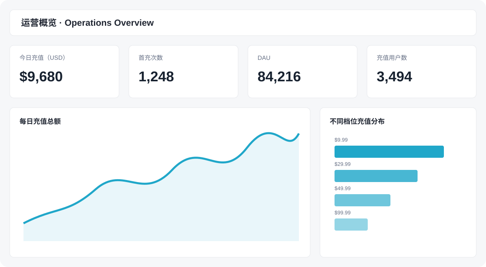

<p align="center">
  
</p>

# SensorFlow

SensorFlow is an open-source, self-hosted product analytics platform for collecting, storing, querying, and visualizing user events.

It is a lightweight alternative to hosted product analytics tools for teams that want to keep event data in their own infrastructure.

> **Live Superset demo:** [https://superset.sensorflow.site/](https://superset.sensorflow.site/)

**Sensors Data SDKs -> ingestion service -> ClickHouse -> Apache Superset**



Designed for simple deployment, low server overhead, predictable pricing, Sensors Data SDK compatibility, and fully customizable Apache Superset BI.

Keywords: self-hosted product analytics, open-source event tracking, user behavior analytics, event instrumentation, 埋点, 埋点分析, 用户行为分析, ClickHouse analytics, and Sensors Data SDK integration.

For Chinese developers, SensorFlow is an open-source **埋点分析平台** and **用户行为埋点系统**.

Languages: [简体中文](README.zh-CN.md) | [日本語](README.ja.md) | [한국어](README.ko.md) | [Deutsch](README.de.md) | [Français](README.fr.md) | [Español](README.es.md) | [Português](README.pt-BR.md)

> **Third-party SDK notice:** Sensors Data SDKs are not distributed by this repository. SensorFlow is independent from and is not endorsed or certified by Sensors Data. Obtain SDKs from official sources and comply with their licenses and terms. See [Third-Party SDK and Trademark Notice](THIRD_PARTY_NOTICES.md).

## Components

- Official Sensors Data SDKs collect events from Android, iOS, Web, mini programs, and server applications.
- The Go ingestion service validates and processes incoming events.
- ClickHouse stores event and user data for analytical queries.
- Apache Superset provides SQL exploration, charts, and dashboards.
- Redis supports ingestion caching.

## Use cases

SensorFlow is suitable for:

- Product analytics and user behavior analysis
- Web, mobile, mini-program, and server event tracking
- Privacy-sensitive teams that need self-hosted analytics
- ClickHouse-based event data analysis
- Sensors Data SDK-compatible data ingestion
- Internal dashboards with Apache Superset
- Replacing hosted analytics tools with a self-managed stack

## Why SensorFlow

- **Self-hosted:** keep event and user data in infrastructure you control.
- **Open source:** inspect, customize, and operate the stack yourself.
- **Operationally simple:** deploy the data stack with Docker Compose.
- **Analytics-ready:** use ClickHouse SQL and Apache Superset dashboards.
- **SDK-compatible:** connect existing Sensors Data SDK applications through the ingestion endpoint.

## Documentation

- [Getting started](docs/getting-started.md)
- [Self-hosted deployment](docs/self-hosted-deployment.md)
- [Product analytics and event tracking](docs/product-analytics.md)
- [ClickHouse and Superset](docs/clickhouse-superset.md)
- [Sensors Data SDK integration](docs/sensors-sdk.md)
- [Open-source alternatives](docs/alternatives.md)

## Guides and comparisons

- [How to evaluate open-source event tracking projects](https://sensorflow.site/resources/guides/github-search-event-tracking)
- [Migrate Sensors Data SDK ingestion to ClickHouse](https://sensorflow.site/use-cases/sensors-sdk-to-clickhouse)
- [SensorFlow vs PostHog vs Matomo](https://sensorflow.site/resources/comparisons/open-source-tracking-platforms)
- [What is event tracking?](https://sensorflow.site/resources/learn/what-is-event-tracking)
- [Build behavior analytics with ClickHouse and Superset](https://sensorflow.site/use-cases/clickhouse-superset-analytics)

## Start the data stack

Install Docker Engine or Docker Desktop with Docker Compose, then run:

```bash
cd deploy/docker
docker compose up -d --build
docker compose ps
```

Compose starts only the infrastructure. Default endpoints:

- ClickHouse HTTP: `http://127.0.0.1:8123`
- ClickHouse native protocol: `127.0.0.1:9000`
- Redis: `127.0.0.1:6379`
- Superset: `http://127.0.0.1:8088`

Set database, Redis, Superset administrator, and `SUPERSET_SECRET_KEY` environment variables before starting Compose. See the Docker deployment guide for the required values.

## Start ingestion

Go 1.17 or newer is required. The Go service runs separately and listens on `8081` by default. Review the Redis and ClickHouse settings in `conf/app.conf`, then run:

```bash
go mod download
go run main.go
```

## Connect an application

This repository does not publish a custom client SDK. Use the official Sensors Data SDK for your platform and set its `serverUrl` to:

```text
https://your-domain.example/sensors/send/?token=YOUR_TOKEN
```

See [Sensors Data SDK integration](docs/sensors-sdk.md) for platform coverage and verification steps.

## Authorization and managed services

For authorization, hosted operations, and commercial plans, visit [sensorflow.site/plans](https://sensorflow.site/plans). Deployment and account documentation is available at [sensorflow.site/docs](https://sensorflow.site/docs).

## Query in Superset

Open `http://127.0.0.1:8088`, select the configured ClickHouse database in SQL Lab, and run:

```sql
SELECT event, count() AS event_count
FROM sensors.event
GROUP BY event
ORDER BY event_count DESC
LIMIT 20;
```

The deployment also provisions an event overview dashboard with event totals, unique devices, trends, and top events.

## Verify and build

```bash
go test ./...
go build -o sensors main.go
```

See [FAQ](FAQ.md) for common issues and [Docker deployment](deploy/docker/README.md) for infrastructure details. Never commit real passwords, tokens, or customer data. See [LICENSE](LICENSE).
